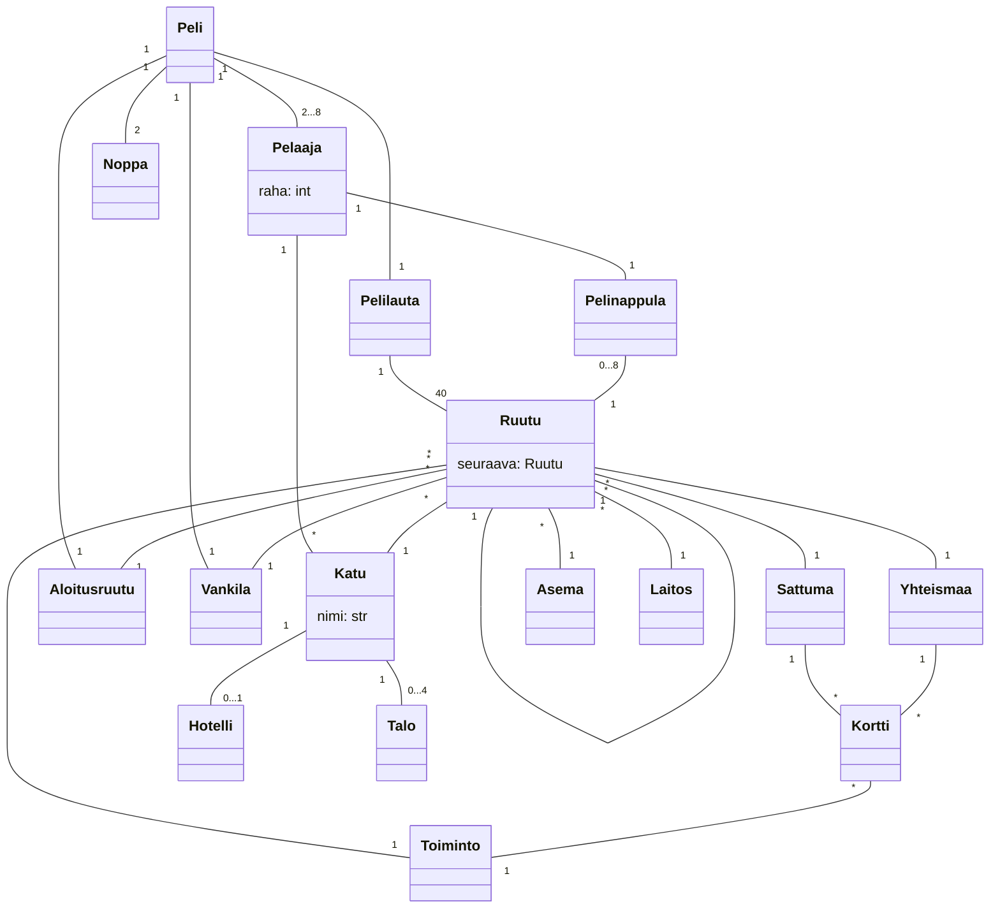

```mermaid
classDiagram
    class Katu{
        nimi: str
    }

    class Ruutu{
        seuraava: Ruutu
    }
    
    class Pelaaja{
        raha: int
    }

    Peli "1" -- "2...8" Pelaaja
    Peli "1" -- "1" Pelilauta
    Peli "1" -- "2" Noppa
    Peli "1" -- "1" Aloitusruutu
    Peli "1" -- "1" Vankila

    Pelilauta "1" -- "40" Ruutu

    Pelaaja "1" -- "1" Pelinappula
    Pelaaja "1" -- "*" Katu
    Pelinappula "0...8" -- "1" Ruutu
    
    Ruutu "1" -- "1" Ruutu
    Ruutu "*" -- "1" Toiminto
    Ruutu "*" -- "1" Aloitusruutu
    Ruutu "*" -- "1" Vankila
    Ruutu "*" -- "1" Sattuma
    Ruutu "*" -- "1" Yhteismaa
    Ruutu "*" -- "1" Asema
    Ruutu "*" -- "1" Laitos
    Ruutu "*" --  "1" Katu

    Sattuma "1" -- "*" Kortti
    Yhteismaa "1" -- "*" Kortti
    
    Kortti "*" -- "1" Toiminto

    Katu "1" -- "0...1" Hotelli
    Katu "1" -- "0...4" Talo
```
