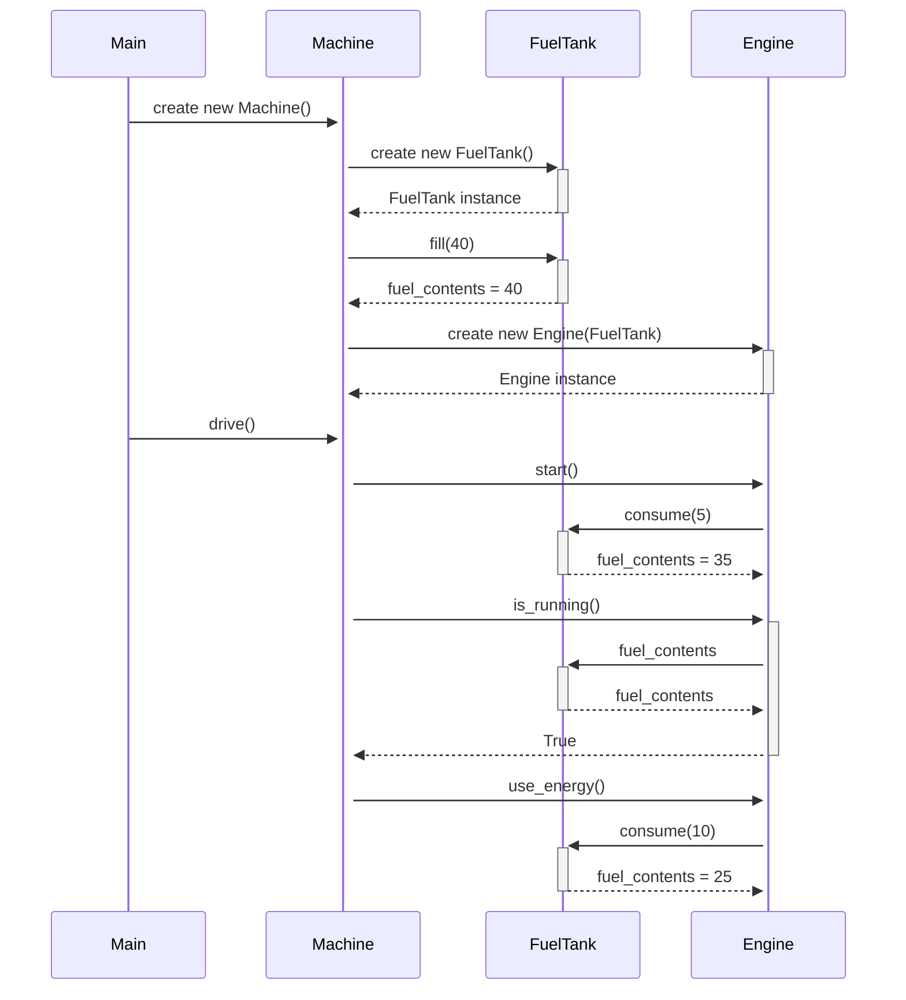

```mermaid

sequenceDiagram
    participant Main
    participant Machine
    participant FuelTank
    participant Engine
    
    Main->>+Machine: create new Machine()
    Machine->>+FuelTank: create new FuelTank()
    FuelTank-->>-Machine: FuelTank instance
    Machine->>+FuelTank: fill(40)
    FuelTank-->>-Machine: fuel_contents = 40
    Machine->>+Engine: create new Engine(FuelTank)
    Engine-->>-Machine: Engine instance
    Main->>+Machine: drive()
    Machine->>+Engine: start()
    Engine->>+FuelTank: consume(5)
    FuelTank-->>-Engine: fuel_contents = 35
    Machine->>+Engine: is_running()
    Engine->>+FuelTank: fuel_contents
    FuelTank-->>-Engine: fuel_contents
    Engine-->>-Machine: True
    Machine->>+Engine: use_energy()
    Engine->>+FuelTank: consume(10)
    FuelTank-->>-Engine: fuel_contents = 25

```
