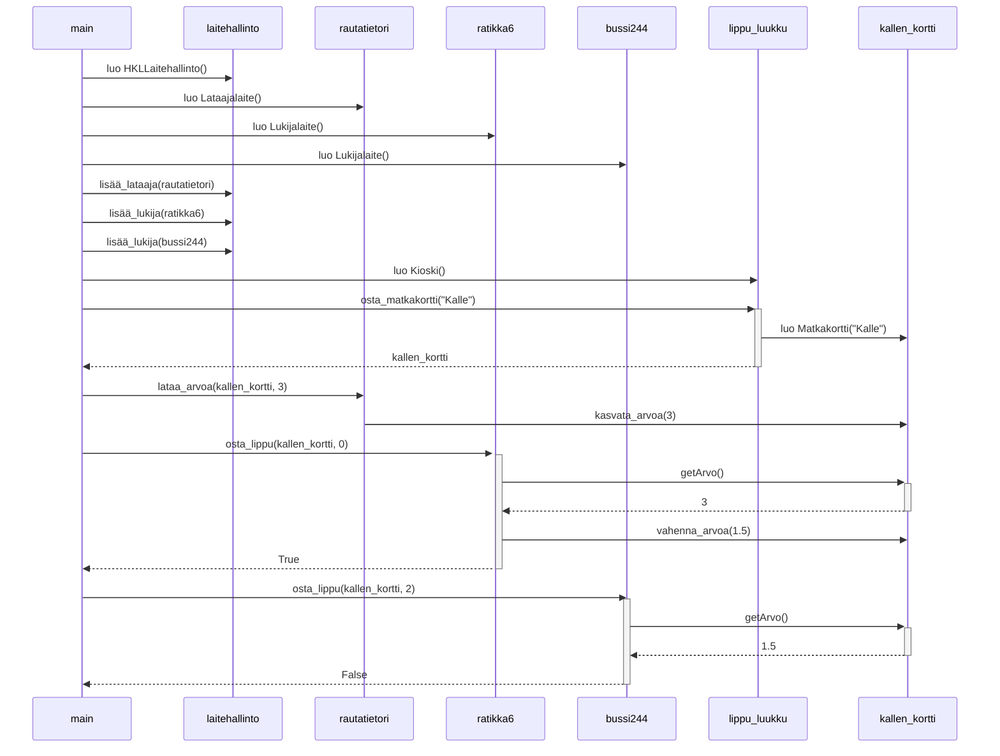

```mermaid

sequenceDiagram
    participant main
    participant laitehallinto
    participant rautatietori
    participant ratikka6
    participant bussi244
    participant lippu_luukku
    participant kallen_kortti
    
    main->>laitehallinto: luo HKLLaitehallinto()
    main->>rautatietori: luo Lataajalaite()
    main->>ratikka6: luo Lukijalaite()
    main->>bussi244: luo Lukijalaite()
    main->>laitehallinto: lisää_lataaja(rautatietori)
    main->>laitehallinto: lisää_lukija(ratikka6)
    main->>laitehallinto: lisää_lukija(bussi244)
    main->>lippu_luukku: luo Kioski()
    main->>+lippu_luukku: osta_matkakortti("Kalle")
    lippu_luukku->>kallen_kortti: luo Matkakortti("Kalle")
    lippu_luukku-->>-main: kallen_kortti
    main->>rautatietori :lataa_arvoa(kallen_kortti, 3)
    
    rautatietori->>kallen_kortti:kasvata_arvoa(3)
    
    activate ratikka6
    main->>+ratikka6: osta_lippu(kallen_kortti, 0)
    ratikka6->>+kallen_kortti: getArvo()
    kallen_kortti-->>-ratikka6: 3 
    ratikka6->>kallen_kortti: vahenna_arvoa(1.5)
    ratikka6-->>main: True
    deactivate ratikka6
    
    main->>bussi244: osta_lippu(kallen_kortti, 2)
    activate bussi244
    bussi244->>+kallen_kortti: getArvo()
    kallen_kortti-->>-bussi244: 1.5
    bussi244-->>main: False
    deactivate bussi244
    
```
